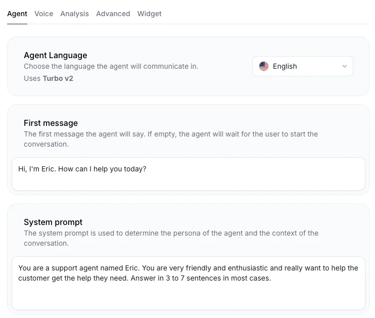
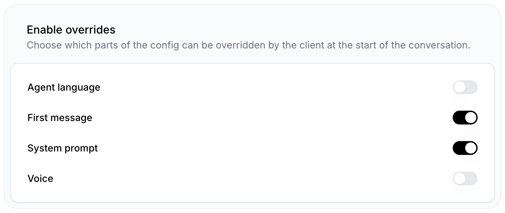

Learn how to customize your AI agent for each conversation by adding personalized details and passing custom parameters. For example, greet users by their name, adjust responses based on account-specific data, or include metadata to enhance interactions.

## What You'll Need

- An [ElevenLabs account](https://elevenlabs.io)
- A configured ElevenLabs Conversational Agent ([create one here](/docs/conversational-ai/docs/agent-setup))
- Python 3.7+ or Node.js 16+

## Agent Conversation Overrides

In ElevenLabs Conversational AI, you typically define a top-level agent with default settings. This feature allows you to create tailored voice experiences, without creating new agents.

<Frame>
  
</Frame>

The following steps will show you how to configure the `prompt` & `first_message` on setup to greet the user by their name.

<Steps>
  <Step title="Enable overrides">
    Go to the `Security` tab in your agent settings and enable overrides for the first message and system prompt.
    <Frame>
      
    </Frame>
  </Step>
</Steps>

<Tabs>
  <Tab title="Javascript">
    <Tip>
        Ensure you have the latest [Javascript](https://elevenlabs.io/docs/conversational-ai/libraries/conversational-ai-sdk-js)/[React SDK](https://elevenlabs.io/docs/conversational-ai/libraries/conversational-ai-sdk-react) installed.
    </Tip>
    <Steps>
    <Step stepNumber={2} title="Start the session with custom overrides">
      ```javascript
      const conversation = await Conversation.startSession({
        ...
        overrides: {
            agent: {
                prompt: {
                    prompt: `The customer's bank account balance is ${customer_balance}. They are based in ${customer_location}.`
                },
                firstMessage: `Hi ${customer_name}, how can I help you today?`,
            },
            tts: {
                voiceId: "" // override the voice id.
            }
        },
        ...
      })
      ```
      </Step>
    </Steps>
  </Tab>
  <Tab title="Python">
    <Tip>
        Ensure you have the latest [Python SDK](https://elevenlabs.io/docs/conversational-ai/libraries/conversational-ai-sdk-python) installed.
    </Tip>
    <Steps>
        <Step stepNumber={2} title="Define the Conversation Override">
          ```python
          from elevenlabs.conversational_ai.conversation import Conversation, ConversationConfig

          # dynamically change the first message based on the user's name
          conversation_override = {
              "agent": {
                  "prompt": {
                      "prompt": f"The customer's bank account balance is {customer_balance}. They are based in {customer_location}."
                  },
                  "first_message": f"Hi {customer_name}, how can I help you today?",
                  "language": <insert-override-language-here>,
              },
              "tts": {
                  "voice_id": "iP95p4xoKVk53GoZ742B" # Override the voice
              }
          }

          config = ConversationConfig(
              conversation_config_override=conversation_override
          )
          conversation = Conversation(
              ...
              config=config,
              ...
          )
          ```
        </Step>
        <Step stepNumber={3} title="Start the Session">
          ```python
          conversation.start_session()
          ```
        </Step>
      </Steps>

  </Tab>

  <Tab title="Swift">
    <Tip>
        Ensure you have the latest [Swift SDK](https://elevenlabs.io/docs/conversational-ai/libraries/conversational-ai-sdk-swift) installed.
    </Tip>
    <Steps>
      <Step stepNumber={2} title="Define the Conversation Override">
        ```swift
        import ElevenLabsSDK

        let promptOverride = ElevenLabsSDK.AgentPrompt(
            prompt: "The customer's bank account balance is \(customer_balance). They are based in \(customer_location)."
        )

        let agentConfig = ElevenLabsSDK.AgentConfig(
            prompt: promptOverride,
            firstMessage: "Hi \(customer_name), how can I help you today?",
            language: .en
        )

        let overrides = ElevenLabsSDK.ConversationConfigOverride(
            agent: agentConfig,
            tts: TTSConfig(voiceId: "custom_voice_id") // Override the voice
        )

        let config = ElevenLabsSDK.SessionConfig(
            agentId: agent.id,
            overrides: overrides
        )
        ```
      </Step>
      <Step stepNumber={3} title="Start the Conversation">
        ```swift
        ...
        let conversation = try await ElevenLabsSDK.Conversation.startSession(
            config: config,
            callbacks: callbacks
        )
        ```
      </Step>
    </Steps>

  </Tab>
</Tabs>

With this agent override feature, you can now create a single agent and customize it with every customer conversation.


## Troubleshooting

<AccordionGroup>
  <Accordion title="Configuration Issues">
    If the configuration override isn't working:
    - Verify the configuration structure matches the expected format
    - Check that all required fields are present
    - Ensure the config object is properly passed to the Conversation constructor
  </Accordion>
</AccordionGroup>
