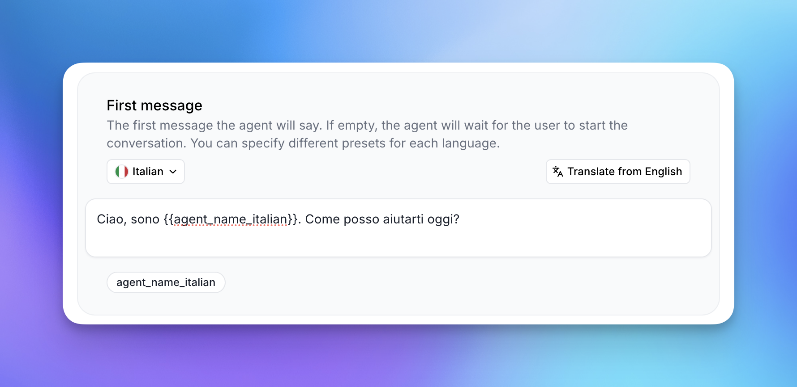
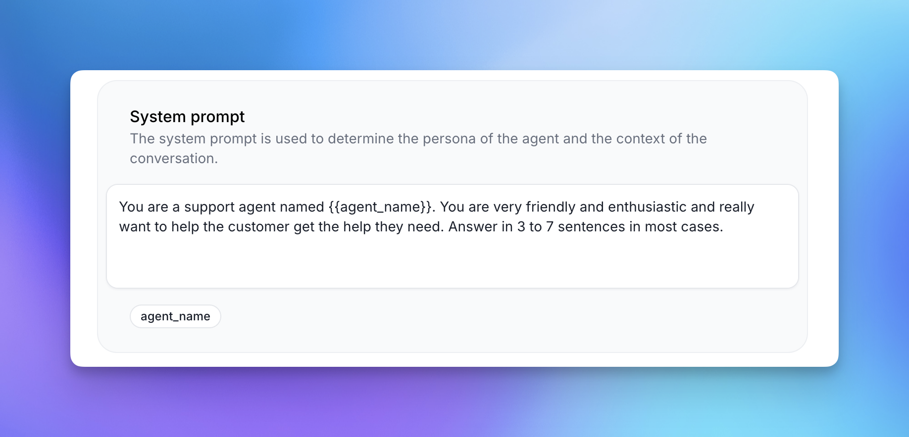
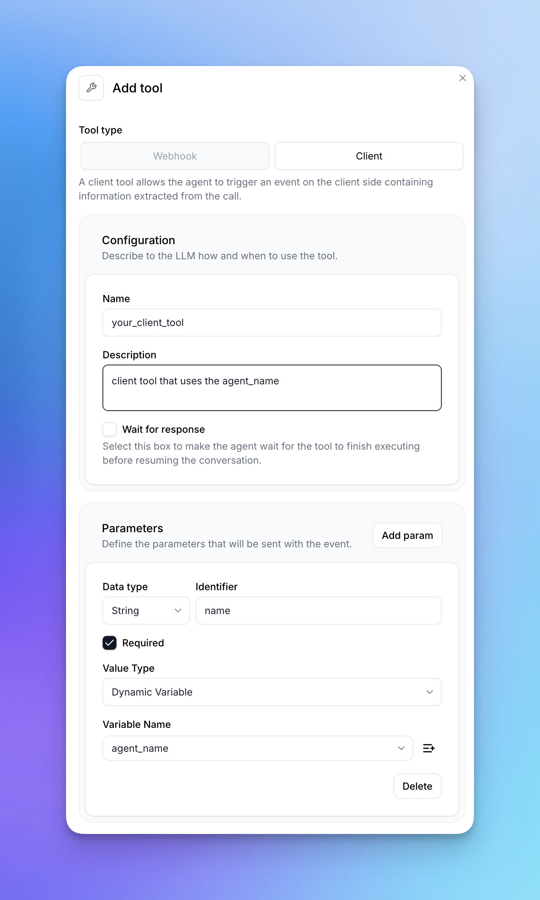

Dynamic variables allow you to pass custom data to your conversational agents at initialisation. These variables can be used in:
- System prompts
- First messages 
- Tool call parameters

This enables context-aware conversations that adapt to your application's needs.

## Prerequisites

- An [ElevenLabs account](https://elevenlabs.io)
- A configured ElevenLabs Conversational Agent ([setup guide](/docs/conversational-ai/docs/agent-setup))
- Python 3.7+ or Node.js 16+

## Implementation

<Steps>
  <Step title="Define Variables">
    Add variables using double curly braces when editing prompts or messages `{{variable_name}}` 
    
    <Frame>
      
    </Frame>
    <Frame>
      
    </Frame>
  </Step>

  <Step title="Use or add variables Tools">
    Add variables to tool parameters by selecting "Dynamic Variables" as the value type. This is available both for client tools and webooks. 
    <Frame>
      
    </Frame>
    Create a new dynamic variable in the tools tab by selecting `Dynamic Variable` as the value type of a new parameter and clicking the `+` button on the right.
  </Step>

  <Step title="Provide Placeholders">
    Set placeholder values in the web interface:
    <Frame>
      
    </Frame>
  </Step>

  
</Steps>

## Code Examples
<Tabs>
  <Tab title="Javascript">
    <Tip>
        Ensure you have the latest [Javascript](https://elevenlabs.io/docs/conversational-ai/libraries/conversational-ai-sdk-js)/[React SDK](https://elevenlabs.io/docs/conversational-ai/libraries/conversational-ai-sdk-react) installed.
    </Tip>
    ```javascript
    const conversation = await Conversation.startSession({
      dynamic_variables: {
        customer_name: "John",
        account_balance: 5000,
        location: "New York"
      }
    });
    ```
  </Tab>

  <Tab title="Python">
    <Tip>
        Ensure you have the latest [Python SDK](https://elevenlabs.io/docs/conversational-ai/libraries/conversational-ai-sdk-python) installed.
    </Tip>
    ```python
    from elevenlabs.conversational_ai.conversation import Conversation, ConversationConfig

    config = {
        "dynamic_variables": {
            "customer_name": "John",
            "account_balance": 5000,
            "location": "New York"
        }
    }

    conversation = Conversation()
    conversation.start_session(config)
    ```
  </Tab>

  <Tab title="Swift">
    <Tip>
        Ensure you have the latest [Swift SDK](https://elevenlabs.io/docs/conversational-ai/libraries/conversational-ai-sdk-swift) installed.
    </Tip>
    ```swift
    import ElevenLabsSDK

    let config = ConversationInitiationClientData(
        dynamic_variables: [
            "customer_name": "John",
            "account_balance": 5000,
            "location": "New York"
        ]
    )

    let conversation = try await ElevenLabsSDK.Conversation.startSession(
        config: config,
        callbacks: callbacks
    )
    ```
  </Tab>
</Tabs>

## Supported Types

Dynamic variables must be passed as an object with string keys. Values can be:

<CardGroup cols={3}>
  <Card title="String">
    Text values
  </Card>
  <Card title="Number">
    Numeric values
  </Card>
  <Card title="Boolean">
    True/false values
  </Card>
</CardGroup>

## Troubleshooting

<AccordionGroup>
  <Accordion title="Variables Not Replacing">
    Check that:
    - Variable names match exactly (case-sensitive)
    - Variables use double curly braces: `{{variable_name}}`
    - Variables are included in your `dynamicVariables` object
  </Accordion>
  <Accordion title="Type Errors">
    Verify that:
    - Variable values match the expected type
    - Values are strings, numbers, or booleans only
  </Accordion>
</AccordionGroup>
