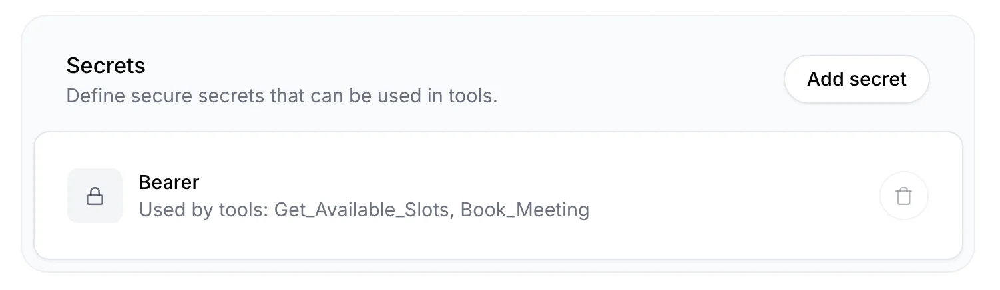
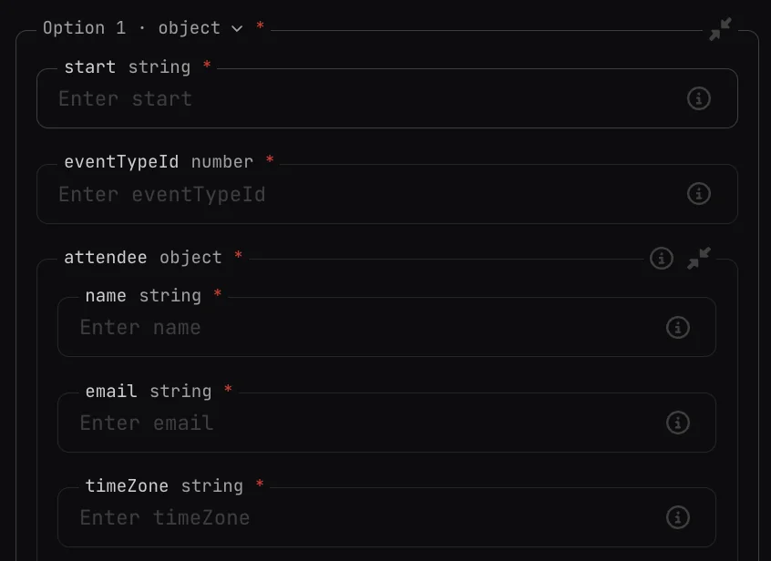

Tools allow you to make external function calls to third party apps so you can get real-time information. You might use tools to:

<CardGroup>
  <Card title="Calendar Management" icon="regular calendar">
    Schedule appointments and manage availability on someone's calendar
  </Card>
  <Card title="Restaurant Bookings" icon="regular utensils">
    Book restaurant reservations and manage dining arrangements
  </Card>
  <Card title="CRM Integration" icon="regular users">
    Create or update customer records in a CRM system
  </Card>
  <Card title="Inventory Lookup" icon="regular box">
    Get inventory data to make product recommendations
  </Card>
</CardGroup>

To help you get started with Tools, we'll walk through an "AI receptionist" we created by integrating with the Cal.com API.

<iframe
  width="100%"
  height="400"
  src="https://www.youtube.com/embed/C2SpW339vqY"
  frameborder="0"
  allow="accelerometer; autoplay; clipboard-write; encrypted-media; gyroscope; picture-in-picture; web-share"
  allowfullscreen
></iframe>

## Tools Overview

### Secrets

Before we proceed with creating our Tools, we will first create a Secret to securely store our API keys. The Cal.com API we will use for our example takes a Bearer token so we will first add a Secret named "Bearer" and provide the Bearer token as the value.

You can find Secrets within the Conversational AI Dashboard in the Agent subnav.



### Webhooks

Next, look for "Tools" in the "Agent" subnav. Add a new Tool to configure your webhook. For our AI receptionist, we created two Tools to interact with the Cal.com API:

<AccordionGroup>
  <Accordion title="Get Available Slots" icon="regular calendar-check">
    This tool allows the AI receptionist to check calendar availability. It can answer questions like "When is Sam available to meet tomorrow?" or "Is Sam free at 10:30am on Tuesday?"

        ```bash
        Name: Get_Available_Slots
        Method: GET
        URL: https://api.cal.com/v2/slots/available
        ```


    Uses Cal.com's [Get Available Slots](https://cal.com/docs/api-reference/v2/slots/get-available-slots#get-available-slots) endpoint to fetch open calendar slots within a specified date/time range.

  </Accordion>

  <Accordion title="Book Meeting" icon="regular calendar-plus">
    This tool handles the actual meeting booking once a suitable time has been selected.

        ```bash
        Name: Book_Meeting
        Method: POST
        URL: https://api.cal.com/v2/bookings
        ```


    Uses Cal.com's [Create a booking](https://cal.com/docs/api-reference/v2/bookings/create-a-booking#create-a-booking) endpoint. This should only be called after collecting:
    - Caller's full name
    - Meeting time
    - Email address

  </Accordion>
</AccordionGroup>

### Headers

Within the Cal.com documentation, we see that our availability endpoint requires only the authorization header: 

    ```bash
    Authorization: Bearer <your-bearer-token>
    ```

While the booking endpoint requires three headers:

    ```bash
    Content-Type: application/json
    cal-api-version: 2024-08-13
    Authorization: Bearer <your-bearer-token>
    ```

We configured that as follows:

| Type   | Name            | Value                                      |
| ------ | --------------- | ------------------------------------------ |
| Value  | Content-Type    | application/json                           |
| Value  | cal-api-version | 2024-08-13                                 |
| Secret | Authorization   | Bearer (the secret key we defined earlier) |

<Frame>
  
</Frame>

### Path Parameters

You can add path parameters by including variables surrounded by curly brackets in your URL like this {variable}. Once added to the URL path, it will appear under Path Parameters with the ability to update the Data Type and Description. 

Our AI receptionist requires path parameters for the Get_Available_Slots tool.

First we add the URL with the variables: 

    ```bash
    URL: https://api.cal.com/v2/slots/available?startTime={startTime}&endTime={endTime}&eventTypeSlug={eventTypeSlug}&eventTypeId={eventTypeId}
    ```

Then we configure the path parameters as follows:

| Type   | Name            | Value                                      |
| ------ | --------------- | ------------------------------------------ |
| String | startTime       | The start time of the slot the person is checking availability for in UTC timezone, formatted as ISO 8601 (e.g., '2024-08-13T09:00:00Z'). Extract time from natural language and convert to UTC. |
| String | endTime         | The end time of the slot the person is checking availability for in UTC timezone, formatted as ISO 8601 (e.g., '2024-08-13T09:00:00Z'). Extract time from natural language and convert to UTC.   |
| String | eventTypeSlug   | The desired meeting length. Should be 15minutes, 30minutes, or 60minutes.                                                                                                                        |
| String | eventTypeId     | The desired meeting length, as an event id. If 15 minutes, return 1351800. If 30 minutes, return 1351801. If 60 minutes, return 1351802 (Fill out with your own event type IDs)                                                         |

Event type IDs can differ. Use the [find event types endpoint](https://cal.com/docs/api-reference/v1/event-types/find-all-event-types) to get the IDs of the relevant events. 

### Query Parameters

Get and Delete requests typically have query parameters while Post and Patch do not. In this case we don't have any query parameters, since the GET request for availability uses path parameters.                                    

### Body Parameters

Post and Patch requests typically have body parameters while Get and Delete do not. Our Book_Meeting tool is a Post request and requires the following Body Parameters: startTime, eventTypeId, attendee.



In our Description for each, we define a prompt that our Conversational Agent will use to extract the relevant information from the call transcript using an LLM.

Here's how we defined our body parameters for our AI receptionist:
| Identifier | Data Type | Required | Description |
|-------------|-----------|----------|--------------------------------------------------------------------------------------------------------------------------------------------------------------------------------------------------|
| startTime | String | Yes | The start time of the slot the person is checking availability for in UTC timezone, formatted as ISO 8601 (e.g., '2024-08-13T09:00:00Z'). Extract time from natural language and convert to UTC. |
| eventTypeId | Number | Yes | The unique Cal event ID for the meeting duration. Use 1351800 for a 15-minute meeting, 1351801 for 30 minutes, and 1351802 for 60 minutes. If no specific duration is provided, default to 1351801 (30 minutes). |
| attendee | Object | Yes | The info on the attendee including their full name, email address and time zone. |

Since attendee is an object, it's subfields are defined as their own parameters:
| Identifier | Data Type | Required | Description |
|------------|-----------|----------|----------------------------------------------------------------------------------------------------------------|
| name | String | Yes | The full name of the person booking the meeting. |
| email | String | Yes | The email address of the person booking the meeting. Should be a properly formatted email. |
| timeZone | String | Yes | The caller's timezone. Should be in the format of 'Continent/City' like 'Europe/London' or 'America/New_York'. |

### Adjusting System Prompt to reference your Tools

Now that you've defined your Tools, instruct your agent on when and how to invoke them in your system prompt. If your Tools require the user to provide information, it's best to ask your agent to collect that information before calling it (though in many cases your agent will be able to realize it is missing information and will request for it anyway).

Here's the System Prompt we use for our AI Receptionist:

> You are my receptionist and people are calling to book a time with me.
>
> You can check my availability by using Get_Available_Slots. That endpoint takes start and end date/time and returns open slots in between. If someone asks for my availability but doesn't specify a date / time, just check for open slots tomorrow. If someone is checking availability and there are no open slots, keep checking the next day until you find one with availability.
>
> Once you've agreed upon a time to meet, you can use Book_Meeting to book a call.
> You will need to collect their full name, the time they want to meet, whether they want to meet for 15, 30 or 60 minutes, and their email address to book a meeting.
>
> If you call Book_Meeting and it fails, it's likely either that the email address is formatted in an invalid way or the selected time is not one where I am available.

### LLM Selection

<Note type="warning">
**When using tools, we recommend avoiding the default LLM (Gemini 1.5 Flash)**, and instead pick another LLM like GPT-4o mini or Claude 3.5 Sonnet.
</Note>

It's important to note that the choice of LLM matters to the success of function calls. Some LLMs can struggle with extracting the relevant parameters from the conversation. 

