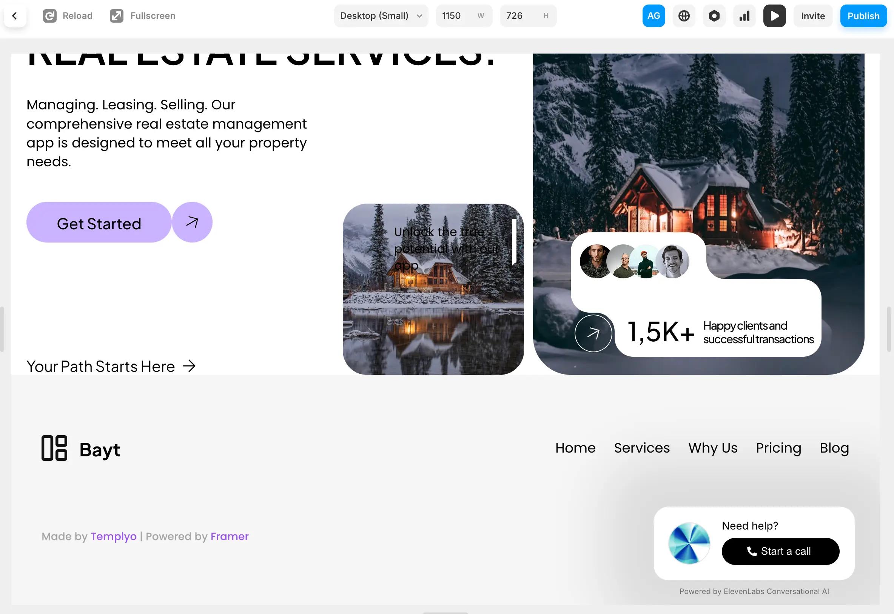
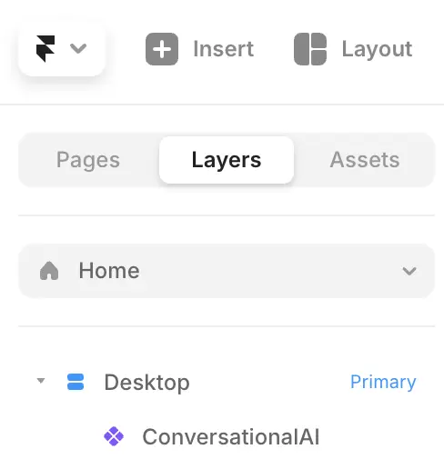

This tutorial will guide you through adding your conversational AI agent to your Framer website. 

## Prerequisites

- An ElevenLabs Conversational AI agent created following [this guide](/docs/conversational-ai/docs/agent-setup)
2. A framer website ready to add your agent to!

<Frame>
  
</Frame>

## Guide

<Steps>
    <Step title="Visit your Framer editor">
        Open your website in the Framer editor and click on the primary desktop on the left.
    </Step>
    <Step title="Add the Conversational AI component">
        Copy and paste the following url into the page you would like to add the Conversational AI agent to:

        ```
        https://framer.com/m/ConversationalAI-TLYB.js@vrSkSPzcAqBl7eEs0YkO
        ```
        You'll now see a Conversational AI asset on the 'Layers' bar on the left and the Conversational AI component's details on the right.
    </Step>

    <Step title="Fill in the agent details">
        Enable the Conversational AI agent by filling in the agent ID in the bar on the right. 
        You can find the agent ID in the [ElevenLabs dashboard](https://elevenlabs.io/app/conversational-ai).

        Your agent's url page is found at https://elevenlabs.io/app/conversational-ai/agentid
    </Step>

</Steps>

Having trouble? Make sure the Conversational AI component is placed below the desktop component in the layers panel.
<Frame width="200">
  
</Frame>


## Next steps

Now that you have added your Conversational AI agent to your Framer website, you can:

1. Customize the widget in the ElevenLabs dashboard to match your brand
2. Add additional languages
3. Add advanced functionality like tools & knowledge base