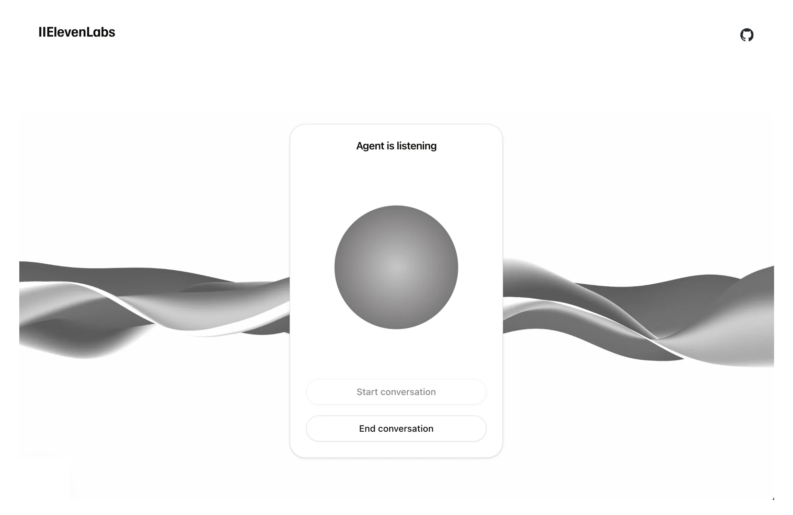

This tutorial will guide you through adding your conversational AI agent to your Framer website. 

## What You'll Need

1. An ElevenLabs conversational AI agent created following [this guide](/docs/conversational-ai/docs/agent-setup)
2. A framer website ready to add your agent to!
3. That's it!

<Frame>
  
</Frame>

## Getting Started

<Steps>
    <Step title="Visit your website">
        Open your Framer website in the browser.
    </Step>
    <Step title="Add the Conversational AI component">
        Copy and paste the following url into the page you would like to add the Conversational AI agent to:

        ```
        https://framer.com/m/ConversationalAI-TLYB.js@vrSkSPzcAqBl7eEs0YkO
        ```
        You'll now see a Conversational AI asset on the 'Layers' bar on the left and the Conversational AI component's details on the right.
    </Step>

    <Step title="Fill in the agent details">
        Enable the Conversational AI agent by filling in the agent ID in the bar on the right. 
        You can find the agent ID in the [ElevenLabs dashboard](https://elevenlabs.io/app/conversational-ai).

        Your agent's url page is found at https://elevenlabs.io/app/conversational-ai/agentid
    </Step>

</Steps>

## Next Steps

Now that you have added your Conversational AI agent to your Framer website, you can:

1. Customize the UI in the ElevenLabs dashboard to match your brand
2. Enable the agent to be multilingual