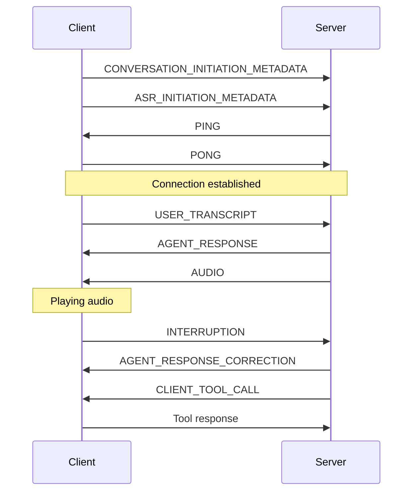

**Client events** are system-level events that facilitate real-time communication between the client and server. These events manage various aspects of the conversation, including audio playback, transcription, interruptions, and more.

## Overview

Client events are essential for maintaining the real-time nature of conversations. They handle everything from initialization to audio playback and user interactions.

<Info>
  These events are part of the WebSocket communication protocol and are automatically handled by our
  SDKs. Understanding them is crucial for advanced implementations and debugging.
</Info>

## Event Types

### Core Events

<AccordionGroup>
  <Accordion title="Initialization Events">
    - `CONVERSATION_INITIATION_METADATA`
      - Automatically sent when starting a conversation
      - Initializes conversation settings and parameters
      - Not manually triggered
    
    - `ASR_INITIATION_METADATA`
      - Sets up speech recognition configuration
      - Automatically handled by the SDK
      - Required for voice input functionality

    ```javascript
    // Example initialization metadata
    {
      "conversation_id": "conv_123",
      "settings": {
        "language": "en",
        "voice_id": "voice_123"
      }
    }
    ```

  </Accordion>

  <Accordion title="Connection Events">
    - `PING`
      - Health check event requiring immediate response
      - Automatically handled by SDK
      - Used to maintain WebSocket connection
      
    ```javascript
    // Example ping handler
    websocket.on('PING', () => {
      websocket.send('PONG');
    });
    ```
  </Accordion>

  <Accordion title="Audio Events">
    - `AUDIO`
      - Contains base64 encoded audio for playback
      - Includes unique event ID for tracking
      - Handles voice output streaming
      
    ```javascript
    // Example audio event handler
    websocket.on('AUDIO', (event) => {
      const { audio_data, event_id } = event;
      audioPlayer.play(audio_data);
    });
    ```
  </Accordion>
</AccordionGroup>

### Interaction Events

<AccordionGroup>
  <Accordion title="User Interaction Events">
    - `USER_TRANSCRIPT`
      - Contains finalized speech-to-text results
      - Represents complete user utterances
      - Used for conversation history

    - `INTERRUPTION`
      - Triggered when user interrupts the agent
      - Stops current audio playback
      - Enables real-time interaction

    ```javascript
    // Example transcript handler
    websocket.on('USER_TRANSCRIPT', (event) => {
      const { text } = event;
      updateConversationHistory(text);
    });
    ```

  </Accordion>

  <Accordion title="Agent Response Events">
    - `AGENT_RESPONSE`
      - Contains complete agent message
      - Sent with first audio chunk
      - Used for display and history

    - `AGENT_RESPONSE_CORRECTION`
      - Contains truncated response after interruption
      - Updates displayed message
      - Maintains conversation accuracy

    ```javascript
    // Example response handler
    websocket.on('AGENT_RESPONSE', (event) => {
      const { text } = event;
      displayAgentMessage(text);
    });
    ```

  </Accordion>

  <Accordion title="Tool Events">
    - `CLIENT_TOOL_CALL`
      - Represents function calls from the agent
      - Contains tool name and parameters
      - Requires client-side implementation

    ```javascript
    // Example tool call handler
    websocket.on('CLIENT_TOOL_CALL', async (event) => {
      const { tool_name, parameters } = event;
      await executeClientTool(tool_name, parameters);
    });
    ```

  </Accordion>
</AccordionGroup>

## Event Flow

Here's a typical sequence of events during a conversation:



## Implementation Guide

### Prerequisites

- An [ElevenLabs account](https://elevenlabs.io)
- Basic understanding of WebSocket communication
- Familiarity with our [SDKs](/docs/conversational-ai/libraries)

### Handling Events

<CodeBlock>
```javascript
import { Conversation } from '@elevenlabs/conversation';

const conversation = await Conversation.startSession({
apiKey: 'your-api-key',
agentId: 'your-agent-id',
handlers: {
onAudio: (audioData) => {
// Handle incoming audio
},
onTranscript: (transcript) => {
// Handle user transcript
},
onAgentResponse: (response) => {
// Handle agent response
},
onInterruption: () => {
// Handle interruption
}
}
});

```
</CodeBlock>

### Best Practices

1. **Error Handling**
   - Implement proper error handling for each event type
   - Log important events for debugging
   - Handle connection interruptions gracefully

2. **Audio Management**
   - Buffer audio chunks appropriately
   - Implement proper cleanup on interruption
   - Handle audio resource management

3. **Connection Management**
   - Respond to PING events promptly
   - Implement reconnection logic
   - Monitor connection health

## Troubleshooting

<AccordionGroup>
  <Accordion title="Connection Issues">
    - Ensure proper WebSocket connection
    - Check PING/PONG responses
    - Verify API credentials
  </Accordion>

  <Accordion title="Audio Problems">
    - Check audio chunk handling
    - Verify audio format compatibility
    - Monitor memory usage
  </Accordion>

  <Accordion title="Event Handling">
    - Log all events for debugging
    - Implement error boundaries
    - Check event handler registration
  </Accordion>
</AccordionGroup>

<Info>
For detailed implementation examples, check our [SDK documentation](/docs/sdk-reference).
</Info>
```
