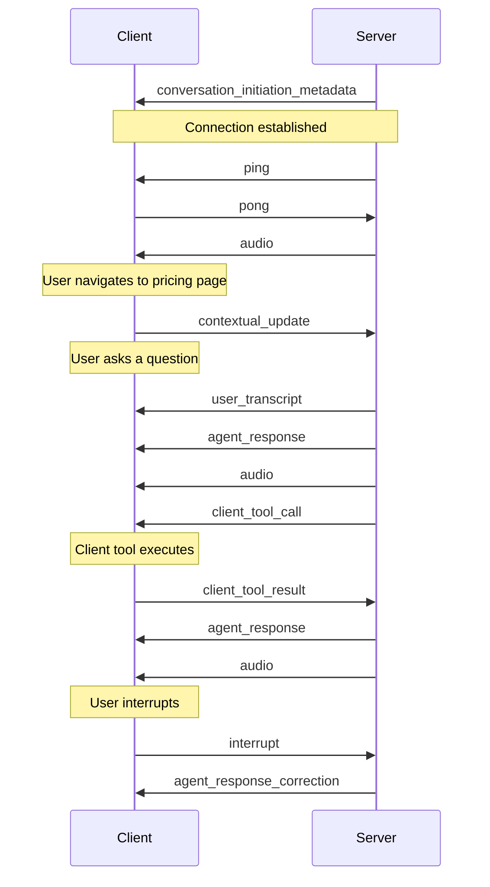

**Client-to-server events** are messages that your application proactively sends to the server to provide additional context during conversations. These events enable you to enhance the conversation with relevant information without interrupting the conversational flow.

<Note>
  For information on events the server sends to the client, see the [Client
  events](/conversational-ai/customization/client-events) documentation.
</Note>

## Overview

Your application can send contextual information to the server to improve conversation quality and relevance. This is particularly useful for sharing UI state, user actions, or other environmental data that may not be directly communicated through voice.

<Info>
  While our SDKs provide helper methods for sending these events, understanding the underlying
  protocol is valuable for custom implementations and advanced use cases.
</Info>

## Contextual updates

The primary client-to-server event is the contextual update, which allows your application to send non-interrupting background information to the conversation.

**Key characteristics:**

- Updates are incorporated as background information in the conversation
- Does not interrupt the current conversation flow
- Useful for sending UI state, user actions, or environmental data

```javascript
// Contextual update event structure
{
  "type": "contextual_update",
  "text": "User appears to be looking at pricing page"
}
```

```javascript
// Example sending contextual updates
function sendContextUpdate(information) {
  websocket.send(
    JSON.stringify({
      type: 'contextual_update',
      text: information,
    })
  );
}

// Usage examples
sendContextUpdate('Customer status: Premium tier');
sendContextUpdate('User navigated to Help section');
sendContextUpdate('Shopping cart contains 3 items');
```

## Best practices

1. **Contextual updates**

   - Send relevant but concise contextual information
   - Avoid overwhelming the AI with too many updates
   - Focus on information that impacts the conversation flow

2. **Tool result handling**

   - Always respond to tool calls promptly
   - Provide clear error messages when tools fail
   - Structure result data consistently

3. **Timing considerations**

   - Send updates at appropriate moments
   - Avoid rapid-fire sequential updates
   - Consider debouncing user interface state changes

## Example flow

Here's a typical sequence showing client-to-server events in a conversation:



<Info>
  For detailed implementation examples, check our [SDK
  documentation](/docs/conversational-ai/libraries/python).
</Info>
