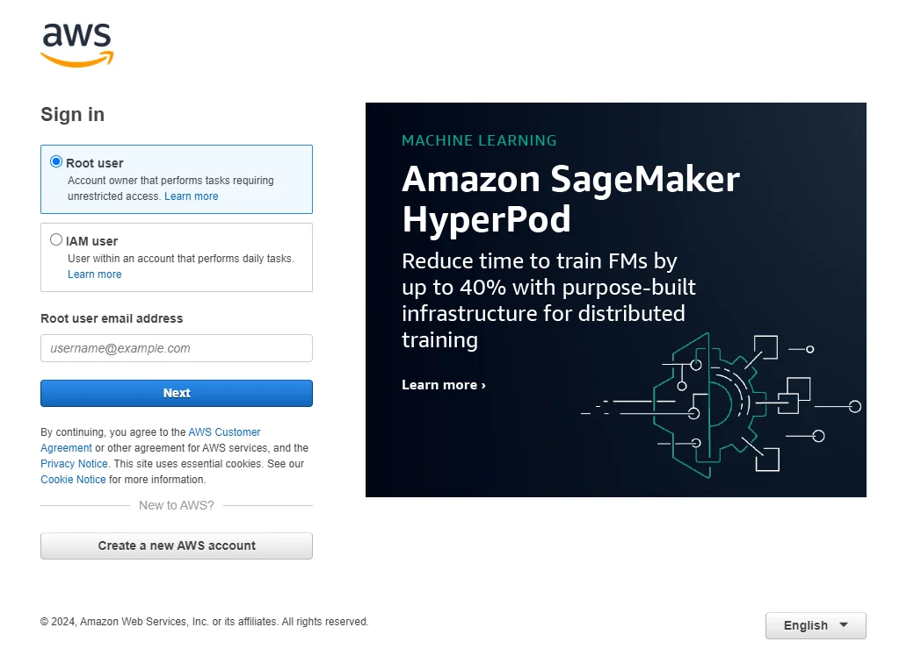

In this tutorial, you'll learn how to transcribe audio with the ElevenLabs SDK. We'll cover both receiving a file and streaming the response back.

Additionally you'll learn how to upload the generated audio to an AWS S3 bucket, and share it through a signed URL. This signed URL will provide temporary access to the audio file, making it perfect for sharing with users by SMS or embedding into an application.

If you want to jump straight to an example you can find them in the [Python](https://github.com/elevenlabs/elevenlabs-examples/tree/main/examples/text-to-speech/python) and [Node.js](https://github.com/elevenlabs/elevenlabs-examples/tree/main/examples/text-to-speech/node) example repositories.

## Requirements

- An ElevenLabs account with an [API key](/docs/developer-guides/quickstart#authentication).
- Python or Node installed on your machine
- (Optionally) an AWS account with access to S3.

<Tabs>
  <Tab title="Python">
    ## Setup

    ### Installing the SDK

    Before you begin, make sure you have installed the ElevenLabs SDK. You can install it using `pip`:

    ```bash
    pip install elevenlabs
    ```

    Additionally, install necessary packages to manage your environmental variables:

    ```bash
    pip install python-dotenv
    ```

    Next, create a `.env` file in your project directory and fill it with your credentials like so:

    ```python .env
    ELEVENLABS_API_KEY=your_elevenlabs_api_key_here
    ```

    ## Convert speech to text

    To convert the audio of a file to text, we'll use the `convert` method of the ElevenLabs SDK.

    ```python title="speech_to_text.py" maxLines=0
    from dotenv import load_dotenv
    from elevenlabs.client import ElevenLabs

    load_dotenv()

    client = ElevenLabs()

    audio_url = (
        "https://storage.googleapis.com/eleven-public-cdn/audio/marketing/nicole.mp3"
    )
    response = requests.get(audio_url)
    audio_data = BytesIO(response.content)

    transcription = client.speech_to_text.convert(
        file=audio_data,
        model_id="scribe_v1", # Model to use, for now only "scribe_v1" is supported
        maximum_speakers=1, # Number of speakers in the audio file
        tag_audio_events=True, # Tag audio events like laughter, applause, etc.
        speech_to_text_language_code="en", # Language of the audio file
        transcribe_verbatim=False, # Transcribe verbatim sounds like "um" and "ah"
    )

    print(transcription)
    ```

    Run the script with:

    ```bash
    python speech_to_text.py
    ```
  </Tab>
  <Tab title="Node">
    ## Setup

    ### Installing the SDK

    Before you begin, make sure you have installed the ElevenLabs SDK. You can install it using `npm`:

    ```bash
    npm install elevenlabs
    ```

    Additionally, install necessary packages to manage your environmental variables:

    ```bash
    npm install dotenv
    ```

    Next, create a `.env` file in your project directory and fill it with your credentials like so:

    ```javascript .env
    ELEVENLABS_API_KEY=your_elevenlabs_api_key_here
    ```

    ## Convert speech to text

    To convert the audio of a file to text, we'll use the `convert` method of the ElevenLabs SDK.

    ```javascript title="speechToText.js" maxLines=0
    import { ElevenLabsClient } from "elevenlabs";

    const client = new ElevenLabsClient();

    const response = await fetch(
        "https://storage.googleapis.com/eleven-public-cdn/audio/marketing/nicole.mp3"
    );
    const audioBlob = new Blob([await response.arrayBuffer()], { type: "audio/mp3" });

    const transcription = await client.speechToText.convert({
        file: audioBlob,
        model_id: "scribe_v1", // Model to use, for now only "scribe_v1" is supported
        maximum_speakers: 1, // Number of speakers in the audio file
        tag_audio_events: true, // Tag audio events like laughter, applause, etc.
        speech_to_text_language_code: "en", // Language of the audio file
        transcribe_verbatim: false, // Transcribe verbatim sounds like "um" and "ah"
    });

    console.log(transcription);
    ```

    Run the script with:

    ```bash
    node speechToText.js
    ```

    ## Convert speech to streaming text

    If you prefer to stream the text directly without saving it to a file, you can use our streaming feature.

    ```javascript title="speechToTextStream.js" maxLines=0
    import { ElevenLabsClient } from "elevenlabs";

    const client = new ElevenLabsClient();

    const transcriptionStream = await client.speechToText.convert({
        file: audioBlob,
        model_id: "scribe_v1", // Model to use, for now only "scribe_v1" is supported
        maximum_speakers: 1, // Number of speakers in the audio file
        tag_audio_events: true, // Tag audio events like laughter, applause, etc.
        speech_to_text_language_code: "en", // Language of the audio file
        transcribe_verbatim: false, // Transcribe verbatim sounds like "um" and "ah"
    });

    const chunks: Buffer[] = [];
    for await (const chunk of transcriptionStream) {
        chunks.push(chunk);
    }

    const content = Buffer.concat(chunks);

    console.log(content);
    ```

    Run the script with:

    ```bash
    node speechToTextStream.js
    ```
  </Tab>
</Tabs>


## Convert text to speech (streaming)

If you prefer to stream the text directly without saving it to a file, you can use our streaming feature.

<CodeGroup>

```python text_to_speech_stream.py (Python)

import os
from typing import IO
from io import BytesIO
from elevenlabs import VoiceSettings
from elevenlabs.client import ElevenLabs

ELEVENLABS_API_KEY = os.getenv("ELEVENLABS_API_KEY")
client = ElevenLabs(
    api_key=ELEVENLABS_API_KEY,
)


def text_to_speech_stream(text: str) -> IO[bytes]:
    # Perform the text-to-speech conversion
    response = client.text_to_speech.convert(
        voice_id="pNInz6obpgDQGcFmaJgB", # Adam pre-made voice
        output_format="mp3_22050_32",
        text=text,
        model_id="eleven_multilingual_v2",
        voice_settings=VoiceSettings(
            stability=0.0,
            similarity_boost=1.0,
            style=0.0,
            use_speaker_boost=True,
        ),
    )

    # Create a BytesIO object to hold the audio data in memory
    audio_stream = BytesIO()

    # Write each chunk of audio data to the stream
    for chunk in response:
        if chunk:
            audio_stream.write(chunk)

    # Reset stream position to the beginning
    audio_stream.seek(0)

    # Return the stream for further use
    return audio_stream

```

```typescript text_to_speech_stream.ts (Typescript)
import * as dotenv from 'dotenv';
import { ElevenLabsClient } from 'elevenlabs';

dotenv.config();

const ELEVENLABS_API_KEY = process.env.ELEVENLABS_API_KEY;

if (!ELEVENLABS_API_KEY) {
  throw new Error('Missing ELEVENLABS_API_KEY in environment variables');
}

const client = new ElevenLabsClient({
  apiKey: ELEVENLABS_API_KEY,
});

export const createAudioStreamFromText = async (text: string): Promise<Buffer> => {
  const audioStream = await client.generate({
    voice: 'Rachel',
    model_id: 'eleven_turbo_v2_5',
    text,
  });

  const chunks: Buffer[] = [];
  for await (const chunk of audioStream) {
    chunks.push(chunk);
  }

  const content = Buffer.concat(chunks);
  return content;
};
```

</CodeGroup>

You can then run this function with:

<CodeGroup>

```python Python
text_to_speech_stream("This is James")
```

```typescript TypeScript
await createAudioStreamFromText('This is James');
```

</CodeGroup>

## Bonus - Uploading to AWS S3 and getting a secure sharing link

Once your audio data is created as either a file or a stream you might want to share this with your users. One way to do this is to upload it to an AWS S3 bucket and generate a secure sharing link.

<AccordionGroup>
<Accordion title="Creating your AWS credentials">

To upload the data to S3 you’ll need to add your AWS access key ID, secret access key and AWS region name to your `.env` file. Follow these steps to find the credentials:

1. Log in to your AWS Management Console: Navigate to the AWS home page and sign in with your account.

<Frame caption="AWS Console Login">
  
</Frame>

2. Access the IAM (Identity and Access Management) Dashboard: You can find IAM under "Security, Identity, & Compliance" on the services menu. The IAM dashboard manages access to your AWS services securely.

<Frame caption="AWS IAM Dashboard">
  
</Frame>

3. Create a New User (if necessary): On the IAM dashboard, select "Users" and then "Add user". Enter a user name.

<Frame caption="Add AWS IAM User">
  
</Frame>

4. Set the permissions: attach policies directly to the user according to the access level you wish to grant. For S3 uploads, you can use the AmazonS3FullAccess policy. However, it's best practice to grant least privilege, or the minimal permissions necessary to perform a task. You might want to create a custom policy that specifically allows only the necessary actions on your S3 bucket.

<Frame caption="Set Permission for AWS IAM User">
  
</Frame>

5. Review and create the user: Review your settings and create the user. Upon creation, you'll be presented with an access key ID and a secret access key. Be sure to download and securely save these credentials; the secret access key cannot be retrieved again after this step.

<Frame caption="AWS Access Secret Key">
  
</Frame>

6. Get AWS region name: ex. us-east-1

<Frame caption="AWS Region Name">
  
</Frame>

If you do not have an AWS S3 bucket, you will need to create a new one by following these steps:

1. Access the S3 dashboard: You can find S3 under "Storage" on the services menu.

<Frame caption="AWS S3 Dashboard">
  
</Frame>

2. Create a new bucket: On the S3 dashboard, click the "Create bucket" button.

<Frame caption="Click Create Bucket Button">
  
</Frame>

3. Enter a bucket name and click on the "Create bucket" button. You can leave the other bucket options as default. The newly added bucket will appear in the list.

<Frame caption="Enter a New S3 Bucket Name">
  
</Frame>

<Frame caption="S3 Bucket List">
  
</Frame>

</Accordion>
<Accordion title="Installing the AWS SDK and adding the credentials">

Install `boto3` for interacting with AWS services using `pip` and `npm`.

<CodeGroup>

```bash Python
pip install boto3
```

```bash TypeScript
npm install @aws-sdk/client-s3
npm install @aws-sdk/s3-request-presigner
```

</CodeGroup>

Then add the environment variables to `.env` file like so:

```
AWS_ACCESS_KEY_ID=your_aws_access_key_id_here
AWS_SECRET_ACCESS_KEY=your_aws_secret_access_key_here
AWS_REGION_NAME=your_aws_region_name_here
AWS_S3_BUCKET_NAME=your_s3_bucket_name_here
```

</Accordion>
<Accordion title="Uploading to AWS S3 and generating the signed URL">

Add the following functions to upload the audio stream to S3 and generate a signed URL.

<CodeGroup>

```python s3_uploader.py (Python)

import os
import boto3
import uuid

AWS_ACCESS_KEY_ID = os.getenv("AWS_ACCESS_KEY_ID")
AWS_SECRET_ACCESS_KEY = os.getenv("AWS_SECRET_ACCESS_KEY")
AWS_REGION_NAME = os.getenv("AWS_REGION_NAME")
AWS_S3_BUCKET_NAME = os.getenv("AWS_S3_BUCKET_NAME")

session = boto3.Session(
    aws_access_key_id=AWS_ACCESS_KEY_ID,
    aws_secret_access_key=AWS_SECRET_ACCESS_KEY,
    region_name=AWS_REGION_NAME,
)
s3 = session.client("s3")


def generate_presigned_url(s3_file_name: str) -> str:
    signed_url = s3.generate_presigned_url(
        "get_object",
        Params={"Bucket": AWS_S3_BUCKET_NAME, "Key": s3_file_name},
        ExpiresIn=3600,
    )  # URL expires in 1 hour
    return signed_url


def upload_audiostream_to_s3(audio_stream) -> str:
    s3_file_name = f"{uuid.uuid4()}.mp3"  # Generates a unique file name using UUID
    s3.upload_fileobj(audio_stream, AWS_S3_BUCKET_NAME, s3_file_name)

    return s3_file_name

```

```typescript s3_uploader.ts (TypeScript)
import { S3Client, PutObjectCommand, GetObjectCommand } from '@aws-sdk/client-s3';
import { getSignedUrl } from '@aws-sdk/s3-request-presigner';
import * as dotenv from 'dotenv';
import { v4 as uuid } from 'uuid';

dotenv.config();

const { AWS_ACCESS_KEY_ID, AWS_SECRET_ACCESS_KEY, AWS_REGION_NAME, AWS_S3_BUCKET_NAME } =
  process.env;

if (!AWS_ACCESS_KEY_ID || !AWS_SECRET_ACCESS_KEY || !AWS_REGION_NAME || !AWS_S3_BUCKET_NAME) {
  throw new Error('One or more environment variables are not set. Please check your .env file.');
}

const s3 = new S3Client({
  credentials: {
    accessKeyId: AWS_ACCESS_KEY_ID,
    secretAccessKey: AWS_SECRET_ACCESS_KEY,
  },
  region: AWS_REGION_NAME,
});

export const generatePresignedUrl = async (objectKey: string) => {
  const getObjectParams = {
    Bucket: AWS_S3_BUCKET_NAME,
    Key: objectKey,
    Expires: 3600,
  };
  const command = new GetObjectCommand(getObjectParams);
  const url = await getSignedUrl(s3, command, { expiresIn: 3600 });
  return url;
};

export const uploadAudioStreamToS3 = async (audioStream: Buffer) => {
  const remotePath = `${uuid()}.mp3`;
  await s3.send(
    new PutObjectCommand({
      Bucket: AWS_S3_BUCKET_NAME,
      Key: remotePath,
      Body: audioStream,
      ContentType: 'audio/mpeg',
    })
  );
  return remotePath;
};
```

</CodeGroup>

You can then call uploading function with the audio stream from the text.

<CodeGroup>

```python Python
s3_file_name = upload_audiostream_to_s3(audio_stream)
```

```typescript TypeScript
const s3path = await uploadAudioStreamToS3(stream);
```

</CodeGroup>

After uploading the audio file to S3, generate a signed URL to share access to the file. This URL will be time-limited, meaning it will expire after a certain period, making it secure for temporary sharing.

You can now generate a URL from a file with:

<CodeGroup>

```python Python
signed_url = generate_presigned_url(s3_file_name)
print(f"Signed URL to access the file: {signed_url}")
```

```typescript TypeScript
const presignedUrl = await generatePresignedUrl(s3path);
console.log('Presigned URL:', presignedUrl);
```

</CodeGroup>

If you want to use the file multiple times, you should store the s3 file path in your database and then regenerate the signed URL each time you need rather than saving the signed URL directly as it will expire.

</Accordion>
<Accordion title="Putting it all together">

To put it all together, you can use the following script:

<CodeGroup>

```python main.py (Python)

import os

from dotenv import load_dotenv

load_dotenv()

from text_to_speech_stream import text_to_speech_stream
from s3_uploader import upload_audiostream_to_s3, generate_presigned_url


def main():
    text = "This is James"

    audio_stream = text_to_speech_stream(text)
    s3_file_name = upload_audiostream_to_s3(audio_stream)
    signed_url = generate_presigned_url(s3_file_name)

    print(f"Signed URL to access the file: {signed_url}")


if __name__ == "__main__":
    main()

```

```typescript index.ts (Typescript)
import 'dotenv/config';

import { generatePresignedUrl, uploadAudioStreamToS3 } from './s3_uploader';
import { createAudioFileFromText } from './text_to_speech_file';
import { createAudioStreamFromText } from './text_to_speech_stream';

(async () => {
  // save the audio file to disk
  const fileName = await createAudioFileFromText(
    'Today, the sky is exceptionally clear, and the sun shines brightly.'
  );

  console.log('File name:', fileName);

  // OR stream the audio, upload to S3, and get a presigned URL
  const stream = await createAudioStreamFromText(
    'Today, the sky is exceptionally clear, and the sun shines brightly.'
  );

  const s3path = await uploadAudioStreamToS3(stream);

  const presignedUrl = await generatePresignedUrl(s3path);

  console.log('Presigned URL:', presignedUrl);
})();
```

</CodeGroup>

</Accordion>
</AccordionGroup>

## Conclusion

You now know how to convert text into speech and generate a signed URL to share the audio file. This functionality opens up numerous opportunities for creating and sharing content dynamically.

Here are some examples of what you could build with this.

1. **Educational Podcasts**: Create personalized educational content that can be accessed by students on demand. Teachers can convert their lessons into audio format, upload them to S3, and share the links with students for a more engaging learning experience outside the traditional classroom setting.

2. **Accessibility Features for Websites**: Enhance website accessibility by offering text content in audio format. This can make information on websites more accessible to individuals with visual impairments or those who prefer auditory learning.

3. **Automated Customer Support Messages**: Produce automated and personalized audio messages for customer support, such as FAQs or order updates. This can provide a more engaging customer experience compared to traditional text emails.

4. **Audio Books and Narration**: Convert entire books or short stories into audio format, offering a new way for audiences to enjoy literature. Authors and publishers can diversify their content offerings and reach audiences who prefer listening over reading.

5. **Language Learning Tools**: Develop language learning aids that provide learners with audio lessons and exercises. This makes it possible to practice pronunciation and listening skills in a targeted way.

For more details, visit the following to see the full project files which give a clear structure for setting up your application:

For Python: [example repo](https://github.com/elevenlabs/elevenlabs-examples/tree/main/examples/text-to-speech/python)

For TypeScript: [example repo](https://github.com/elevenlabs/elevenlabs-examples/tree/main/examples/text-to-speech/node)

If you have any questions please create an issue on the [elevenlabs-doc Github](https://github.com/elevenlabs/elevenlabs-docs/issues).
