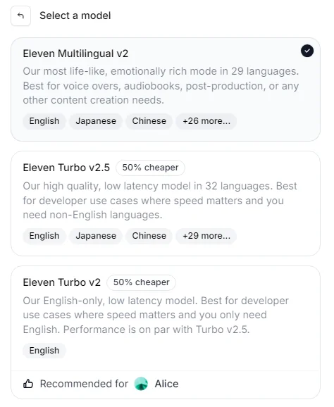

As of September 2024, ElevenLabs offers two families of models: standard (high-quality) models and Turbo models, which are optimized for low latency. Each family includes both English-only and multilingual models, tailored for specific use cases with strengths in either speed, accuracy, or language diversity.

- **Standard models** (Multilingual v2, Multilingual v1, English v1) are optimized for quality and accuracy, ideal for content creation. These models offer the best quality and stability but have higher latency.
- **Turbo models** (Turbo v2, Turbo v2.5) are designed for low-latency applications like real-time conversational AI. They deliver great performance with faster processing speeds, though with a slight trade-off in accuracy and stability.

If you want to find more detailed specifications about which languages each model offers, you can find all that information in our help article [here](https://help.elevenlabs.io/hc/en-us/articles/17883183930129-What-models-do-you-offer-and-what-is-the-difference-between-them-).

For advice on how to deal with issues that might arise, please see our guide to [troubleshooting](/docs/product/troubleshooting/overview).

<Frame caption="Model Selection">
    
</Frame>

## **Standard Models**

**Eleven Multilingual v2**

Our most advanced speech synthesis model, Multilingual v2, offers high stability, diverse language support, and exceptional accuracy in 29 languages. While slower than the Turbo models, it delivers more lifelike speech, making it ideal for content creation such as voiceovers, audiobooks, and post-production.

<Accordion title="Supported languages">
- English (UK)
- English (USA)
- English (Australia)
- English (Canada)
- Japanese
- Chinese
- German
- Hindi
- French (France)
- French (Canada)
- Korean
- Portuguese (Brazil)
- Portuguese (Portugal)
- Italian
- Spanish (Spain)
- Spanish (Mexico)
- Indonesian
- Dutch
- Turkish
- Filipino
- Polish
- Swedish
- Bulgarian
- Romanian
- Arabic (Saudi Arabia)
- Arabic (UAE)
- Czech
- Greek
- Finnish
- Croatian
- Malay
- Slovak
- Danish
- Tamil
- Ukrainian
- Russian
</Accordion>

**Important notes**: The accuracy of this model depends heavily on the quality of the input samples. Lower-quality samples can introduce errors, which the AI might attempt to replicate. For the best results, use high-quality, consistent voice samples, especially when trying to preserve accents or tonal details across languages.
- Best quality
- Unparalleled accuracy
- More stable
- Higher latency

**Eleven English v1**

Our very first model, English v1, laid the groundwork for future advancements. While still functional, it is now outclassed by Multilingual v2 (for content creation) and Turbo v2.5 (for low-latency applications). We recommend using our newer models for better quality and speed.

**Eleven Multilingual v1**

Multilingual v1 was our first attempt at generating speech in multiple languages, but it is now considered experimental and has been surpassed by Multilingual v2 and Turbo v2.5. We recommend avoiding this model for production use due to its limitations and lower accuracy.

<Accordion title="Supported languages">
- English (USA) 
- English (UK) 
- English (Australia) 
- English (Canada) 
- German 
- Polish 
- Spanish (Spain)
- Spanish (Mexico)
- Italian
- French (France)
- French (Canada)
- Portuguese (Portugal)
- Portuguese (Brazil)
- Hindi
</Accordion>

## **Turbo Models**

**Eleven Turbo v2.5**

Turbo v2.5 generates speech in 32 languages with low latency, optimized for real-time conversational AI use cases. This model is 300% faster than Multilingual v2 and now supports new languages such as Vietnamese, Hungarian, and Norwegian. It is best for developers requiring rapid, natural speech across multiple languages, but it lacks the stylistic range of Multilingual v2.

Latency is as low as 300ms, making it ideal for real-time interactions.
- Great quality
- High accuracy with Professional Voice Clones
- Slightly less stable
- Optimized for low latency

<Accordion title="Supported languages">
- English (USA) 
- English (UK) 
- English (Australia) 
- English (Canada) 
- Japanese 
- Chinese 
- German 
- Hindi 
- French (France) 
- French (Canada) 
- Korean 
- Portuguese (Brazil) 
- Portuguese (Portugal) 
- Italian 
- Spanish (Spain) 
- Spanish (Mexico) 
- Indonesian 
- Dutch 
- Turkish 
- Filipino 
- Polish 
- Swedish 
- Bulgarian 
- Romanian 
- Arabic (Saudi Arabia) 
- Arabic (UAE) 
- Czech 
- Greek 
- Finnish 
- Croatian 
- Malay 
- Slovak 
- Danish 
- Tamil 
- Ukrainian 
- Russian
- Hungarian
- Norwegian
- Vietnamese
</Accordion>

**Eleven Turbo v2**

A low-latency, English-only model optimized for conversational applications. Turbo v2 is similar in performance to Turbo v2.5 but focused exclusively on English, making it ideal for English-only use cases where speed is critical.
- Great quality
- High accuracy with Professional Voice Clones
- Slightly less stable
- Optimized for low latency

<Accordion title="Supported languages">
- English (USA) 
- English (UK) 
- English (Australia) 
- English (Canada) 
</Accordion>
